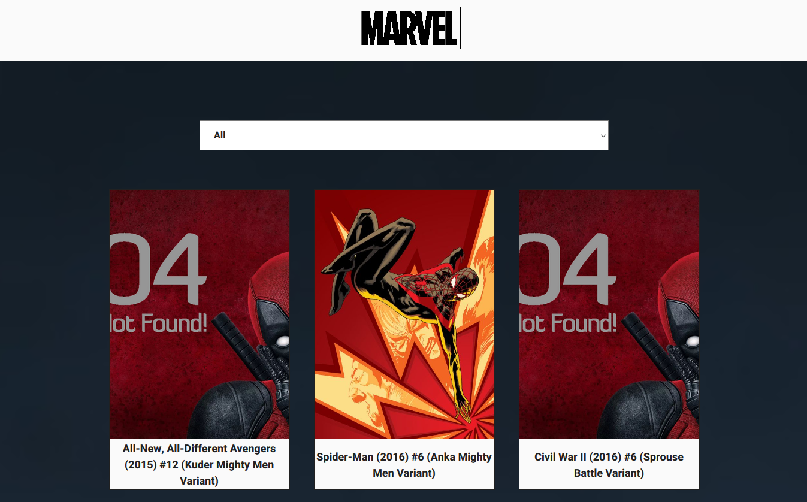

[![Contributors][contributors-shield]][contributors-url]
[![Issues][issues-shield]][issues-url]
 

  <h2 align="center"> Marvel Comics </h2>
  

  	Catalog of Marvel Comics (React-Redux ♦️)
     
    <a href="https://github.com/Fig77/Marvel-Comics"><strong>Explore the docs »</strong></a>
     

# Catalog of Comics

Project consist in an React-Redux APP that fetchs data from an API and shows it as a catalog. You can see a preview, see details of the item and filter them by format. Uses client-side routing, and saves store data to not fetch multiple times the same content after updating.

Index
=====
   * [Built with](#built-width)
   * [Prequisites](#prequisites)
   * [Usage](#usage)
      - [Screenshots](#screenshots)
      - [Live](#live)
   * [Testing](#testing)
   * [Contributing](#contributing)
   * [Contact](#credits)

### Built With

* React
* React-DOM
* React-Create-App
* Redux
* testing-library/react - Jest
* npm
* CSS
* ES6

### Prequisites

- Node
- NPM
- React/Redux

## Usage

* Clone the repo with `git clone https://github.com/Fig77/Marvel-Comics.git`, or download as a ZIP.
* Run `npm install`
* Run `npm start`

Keep in mind that only 40 items are fetch from the API.

## Screenshots

## Live

## Testing

- Run `npm test`to run the test suites.

## Contributing

Pull requests are welcome. For major changes, please open an issue first to discuss what you would like to change.

Please make sure to update tests as appropriate.

## Contact

Facundo Iglesias - [Github profile](https://github.com/Fig77)

Project Link: [Project repo](https://github.com/Fig77/calculator-react/)

## License
[MIT](https://choosealicense.com/licenses/mit/)

<!-- MARKDOWN LINKS & IMAGES -->
<!-- https://www.markdownguide.org/basic-syntax/#reference-style-links -->
[contributors-shield]: https://img.shields.io/badge/Contributors-1-brightgreen
[contributors-url]: https://github.com/Fig77/Marvel-Comics/graphs/contributors
[issues-shield]: https://img.shields.io/badge/issues-0-%2300ff00
[issues-url]: https://github.com/Fig77/Marvel-Comics/issues
[product-screenshot]: assets/menu.png